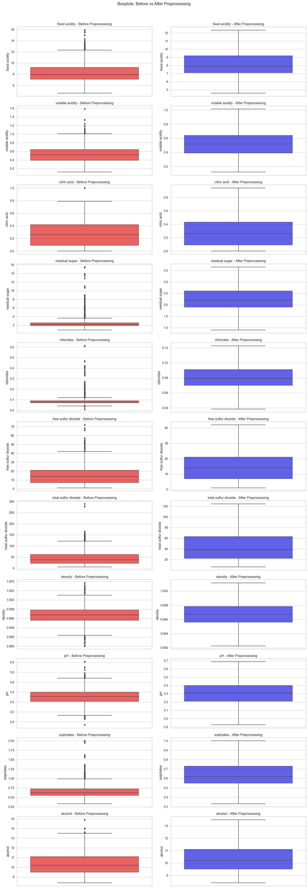

# Laporan Proyek Machine Learning - Muhammad Hasan Fadhlillah

## Domain Proyek

Industri anggur (_wine_) merupakan sektor agrikultur dan ekonomi yang signifikan secara global. Kualitas anggur adalah faktor penentu utama yang mempengaruhi harga, kepuasan konsumen, dan reputasi produsen. Secara tradisional, kualitas anggur dievaluasi oleh panel pencicip ahli melalui proses sensorik yang bisa jadi subjektif, memakan waktu, dan mahal. Dengan kemajuan teknologi, terdapat kebutuhan untuk metode penilaian kualitas anggur yang lebih objektif, efisien, dan konsisten.

- **Mengapa dan bagaimana masalah tersebut harus diselesaikan:**
  Masalah subjektivitas dan biaya tinggi dalam penilaian kualitas anggur perlu diselesaikan untuk membantu produsen mempertahankan standar kualitas yang konsisten, mengoptimalkan proses produksi, dan memberikan informasi yang lebih transparan kepada konsumen. Pemanfaatan _machine learning_ untuk memprediksi kualitas anggur berdasarkan parameter fisikokimia dapat menjadi solusi. Model prediktif dapat menganalisis data dari tes laboratorium (seperti keasaman, kadar gula, alkohol, dll.) untuk mengklasifikasikan kualitas anggur secara otomatis. Hal ini dapat mempercepat proses evaluasi, mengurangi biaya, dan memberikan _insight_ tentang faktor-faktor apa saja yang paling berpengaruh terhadap kualitas anggur.
- **Referensi Hasil Riset Terkait:**
  1. Cortez, P., Cerdeira, A., Almeida, F., Matos, T., & Reis, J. (2009). Modeling wine preferences by data mining from physicochemical properties. _Decision Support Systems_, _47_(4), 547–553. <https://doi.org/10.1016/j.dss.2009.05.016>
  2. Dahal, K. R., Dahal, J. N., Banjade, H., & Gaire, S. (2021). Prediction of wine quality using machine learning algorithms. _Open Journal of Statistics_, _11_(2), 278–289. <https://doi.org/10.4236/ojs.2021.112015>
  3. Gonzalez Viejo, C., & Fuentes, S. (2022). Digital assessment and classification of wine faults using a low-cost electronic nose, near-infrared spectroscopy and machine learning modelling. _Sensors_, _22_(6), 2303. <https://doi.org/10.3390/s22062303>
  4. Jain, K., Kaushik, K., Gupta, S. K., Mahajan, S., & Kadry, S. (2023). Machine learning-based predictive modelling for the enhancement of wine quality. _Scientific Reports_, _13_(1), 17042. <https://doi.org/10.1038/s41598-023-44111-9>
  5. Kumar, S., Agrawal, K., & Mandan, N. (2020). Red wine quality prediction using machine learning techniques. _2020 International Conference on Computer Communication and Informatics (ICCCI)_, 1–6. IEEE. <https://doi.org/10.1109/ICCCI48352.2020.9104095>

## Business Understanding

Pada bagian ini, dijelaskan proses klarifikasi masalah terkait prediksi kualitas anggur merah.

### Problem Statements

- Bagaimana cara mengembangkan sistem yang objektif untuk menilai kualitas anggur merah berdasarkan data uji fisikokimia untuk mengurangi subjektivitas dan inkonsistensi dari penilai manusia?
- Faktor fisikokimia apa saja yang paling signifikan dalam menentukan kualitas anggur merah?
- Dapatkah model _machine learning_ dibangun untuk secara akurat mengklasifikasikan anggur merah ke dalam kategori kualitas ("Baik" vs "Tidak Baik") dengan efisiensi yang lebih tinggi daripada metode konvensional?

### Goals

- Mengembangkan beberapa model klasifikasi _machine learning_ untuk memprediksi kualitas anggur merah ("Baik" atau "Tidak Baik") dan memilih model terbaik.
- Mengidentifikasi fitur-fitur fisikokimia yang memiliki pengaruh paling besar terhadap kualitas anggur merah menggunakan model terbaik tersebut.
- Mencapai F1-score setinggi mungkin pada model prediksi kualitas anggur untuk memastikan keandalannya dalam menangani potensi ketidakseimbangan kelas.

  ### Solution statements

  Untuk mencapai tujuan di atas, berikut adalah pendekatan solusi yang diajukan secara sistematis:

  1. **Analisis Data Eksploratif (EDA):** Melakukan analisis mendalam untuk memahami distribusi data, mengidentifikasi _outlier_, dan melihat korelasi antar variabel fisikokimia dengan kualitas anggur.

  2. **Persiapan Data:** Membersihkan data dengan menangani duplikat dan _outlier_, serta melakukan standardisasi fitur untuk memastikan semua variabel memiliki skala yang sebanding, yang krusial bagi beberapa algoritma.

  3. **Pengembangan Model Awal:** Menggunakan tiga algoritma klasifikasi yang berbeda untuk membangun model prediksi:

     - **Logistic Regression:** Sebagai model dasar (_baseline_) karena kesederhanaan dan interpretasibilitasnya.
     - **Random Forest Classifier:** Sebagai model _ensemble_ yang kuat dan seringkali memberikan performa yang baik serta tahan terhadap _overfitting_.
     - **Support Vector Machine (SVM):** Sebagai model kuat lainnya yang efektif dalam ruang berdimensi tinggi dan masalah klasifikasi non-linear.

  4. **Evaluasi dan Pemilihan Model:** Mengevaluasi ketiga model menggunakan metrik F1-Score, Akurasi, Presisi, dan Recall. Model dengan F1-Score tertinggi akan dipilih sebagai kandidat terbaik.

  5. **Optimasi Model Terbaik dengan Hyperparameter Tuning:** Model dengan performa terbaik dari ketiga algoritma di atas (berdasarkan metrik F1-score) akan dioptimalkan lebih lanjut menggunakan teknik `GridSearchCV`. Solusi ini terukur karena peningkatan (atau perubahan) performa dapat dilihat dari perbandingan nilai metrik evaluasi sebelum dan sesudah _tuning_.

  6. **Analisis Fitur Penting:** Menggunakan teknik _Permutation Importance_ pada model final untuk mengidentifikasi dan mengurutkan faktor fisikokimia yang paling berpengaruh terhadap kualitas anggur, sehingga menjawab pertanyaan bisnis utama.

## Data Understanding

Dataset yang digunakan dalam proyek ini adalah "Wine Quality Dataset," khususnya data untuk anggur merah (_red wine_). Dataset ini bersumber dari UCI Machine Learning Repository dan merupakan hasil penelitian oleh Cortez et al. (2009).

**Sumber Data:** [Wine Quality Dataset - Kaggle](https://www.kaggle.com/datasets/uciml/red-wine-quality-cortez-et-al-2009). Pada notebook, data diakses melalui path lokal `./datasets/winequality-red.csv`.

**Inspeksi Awal Data:**

- **Struktur Data:** Dataset terdiri dari **1599 sampel** dan **12 kolom** (11 fitur, 1 target). Semua fitur bertipe numerik (`float64`), dan target `quality` bertipe `int64`.
- **Kualitas Data:**
  - Tidak ditemukan nilai yang hilang (_missing values_).
  - Ditemukan adanya **240 baris duplikat**.
- **Statistik Deskriptif:**
  - Variabel target `quality` memiliki rentang nilai dari 3 hingga 8.
  - Terdapat variasi skala yang sangat besar antar fitur. Contohnya, `total sulfur dioxide` memiliki nilai maksimum 289, sedangkan `chlorides` hanya 0.611. Hal ini mengindikasikan kuat bahwa **penskalaan fitur (feature scaling) akan menjadi langkah krusial.**

### Variabel-variabel pada Red Wine Quality Dataset

- **`fixed acidity`**: sebagian besar asam yang terlibat dengan anggur atau tetap atau nonvolatil (tidak mudah menguap) (g/dm³).
- **`volatile acidity`**: jumlah asam asetat dalam anggur, yang pada tingkat tinggi dapat menyebabkan rasa tidak enak seperti cuka (g/dm³).
- **`citric acid`**: ditemukan dalam jumlah kecil, asam sitrat dapat menambah 'kesegaran' dan rasa pada anggur (g/dm³).
- **`residual sugar`**: jumlah gula yang tersisa setelah fermentasi berhenti (g/dm³).
- **`chlorides`**: jumlah garam dalam anggur (g/dm³).
- **`free sulfur dioxide`**: SO₂ dalam bentuk bebas (mg/dm³).
- **`total sulfur dioxide`**: jumlah bentuk SO₂ bebas dan terikat (mg/dm³).
- **`density`**: massa jenis anggur (g/cm³).
- **`pH`**: menggambarkan seberapa asam atau basa suatu anggur pada skala dari 0 (sangat asam) hingga 14 (sangat basa).
- **`sulphates`**: aditif anggur yang dapat berkontribusi pada kadar gas sulfur dioksida (SO₂) (g/dm³).
- **`alcohol`**: persentase kandungan alkohol dalam anggur (vol %).
- **`quality`** (Variabel Target): skor antara 3 dan 8 yang diberikan oleh penilai ahli.

### Exploratory Data Analysis (EDA)

Tahapan EDA telah dilakukan untuk lebih memahami data, meliputi:

1. **Distribusi Variabel Target:** Variabel target `quality` diubah menjadi biner (`quality_category`) untuk menyederhanakan masalah: skor \> 5 menjadi 'Baik' (1) dan skor ≤ 5 menjadi 'Tidak Baik' (0).

   
   _Gambar 1: Distribusi Variabel Target Biner_

   - **Insight:** Setelah transformasi, terdapat 744 sampel masuk kategori 'Tidak Baik' (skor ≤ 5) dan 855 sampel 'Baik' (skor > 5). Distribusi kelas ini cukup seimbang, yang baik untuk pemodelan klasifikasi.

2. **Distribusi Fitur Numerik:** Visualisasi menggunakan histogram menunjukkan bahwa banyak fitur memiliki distribusi yang miring ke kanan (_right-skewed_), terutama `fixed acidity`, `residual sugar`, `chlorides`, `free sulfur dioxide`, `total sulfur dioxide`, dan `sulphates`.

   
   _Gambar 2: Distribusi Fitur Numerik_

   - **Insight:** Hal ini mengindikasikan bahwa sebagian besar anggur memiliki nilai rendah pada fitur-fitur ini, dengan beberapa memiliki nilai yang sangat tinggi.

3. **Deteksi Outlier:** Visualisasi menggunakan _boxplot_ pada semua fitur input menunjukkan adanya banyak titik data yang berada di luar jangkauan interkuartil (IQR).

   
   _Gambar 3: Deteksi Outlier_

   - **Insight:** Hal ini mengindikasikan keberadaan _outlier_ yang signifikan di hampir semua variabel, yang perlu ditangani pada tahap persiapan data untuk mencegah distorsi pada model.

4. **Analisis Korelasi:** _Heatmap_ korelasi digunakan untuk melihat hubungan antar variabel.

   
   _Gambar 4: Korelasi Antar Variabel_

   - **Insight:** Hal ini menunjukkan bahwa `alcohol` memiliki korelasi positif terkuat dengan `quality` (koefisien 0.48), yang berarti semakin tinggi kadar alkohol, kualitasnya cenderung lebih baik. Sebaliknya, `volatile acidity` memiliki korelasi negatif terkuat (-0.39), yang berarti keasaman volatil yang lebih tinggi cenderung menurunkan kualitas anggur. Kedua fitur ini adalah kandidat prediktor terkuat.

## Data Preparation

Proses persiapan data dilakukan secara sistematis untuk memastikan kualitas dan kesiapan data untuk pemodelan.

1. **Transformasi Variabel Target:** Variabel `quality` (skala 3-8) diubah menjadi variabel biner `quality_category`. Anggur dengan `quality` > 5 dikategorikan sebagai 'Baik' (1) dan `quality` <= 5 sebagai 'Tidak Baik' (0).
2. **Penanganan Data Duplikat:** Sebanyak 240 baris data yang terduplikasi dihapus dari dataset untuk menghindari bias pada model. Ukuran dataset berkurang dari 1599 menjadi **1359 sampel unik**.
3. **Penanganan Outlier:** _Outlier_ pada semua fitur input ditangani menggunakan metode IQR. Nilai yang berada di luar batas (Q1 - 1.5*IQR dan Q3 + 1.5*IQR) digantikan dengan nilai batas tersebut (_capping/winsorization_). Hasil menunjukkan jumlah _outlier_ pada semua fitur menjadi **0** setelah proses ini.
4. **Pemisahan Data (Train-Test Split):** Dataset dibagi menjadi data latih 80% (1087 sampel) dan data uji 20% (272 sampel) dengan proporsi 80:20. Parameter `stratify=y` digunakan untuk memastikan distribusi kelas target tetap proporsional di kedua set (proporsi kelas 'Baik' dan 'Tidak Baik' sama di data latih dan uji), dan `random_state=42` untuk reproduktifitas.
5. **Penskalaan Fitur (Standardization):** Semua fitur input distandarisasi menggunakan `StandardScaler`. Skaler ini dilatih (_fit_) hanya pada data latih dan kemudian digunakan untuk mentransformasi (_transform_) data latih dan data uji untuk mencegah kebocoran data. Semua fitur kini memiliki _mean_ mendekati 0 dan standar deviasi 1, membuat mereka sebanding.

- **Proses dan Alasan Data Preparation:**

Proses persiapan data dimulai dengan mengubah variabel target quality menjadi format biner (quality_category) untuk menyederhanakan masalah menjadi klasifikasi. Setelah inspeksi awal, ditemukan 240 baris data duplikat yang kemudian dihapus untuk memastikan setiap sampel bersifat unik. Selanjutnya, dilakukan penanganan outlier menggunakan metode IQR; nilai-nilai ekstrem pada setiap fitur digantikan dengan nilai ambang batasnya (capping) untuk mengurangi distorsi pada model. Setelah data bersih, dataset dibagi menjadi data latih (80%) dan data uji (20%) menggunakan metode pemisahan terstratifikasi untuk menjaga proporsi kelas. Terakhir, semua fitur input pada data latih dan uji distandarisasi menggunakan StandardScaler. Proses fitting skaler ini hanya dilakukan pada data latih untuk mencegah kebocoran informasi dari data uji, yang kemudian digunakan untuk mentransformasi kedua set data tersebut.

Setiap tahapan persiapan data memiliki tujuan spesifik.

- **Transformasi Target:** Diperlukan untuk mengubah masalah dari regresi/klasifikasi multikelas menjadi format klasifikasi biner yang sesuai dengan tujuan proyek ("Baik" vs "Tidak Baik").
- **Penanganan Duplikat:** Krusial untuk memastikan setiap sampel data unik dan mencegah model menjadi bias atau terlalu percaya diri terhadap sampel yang berulang.
- **Penanganan Outlier:** Dilakukan untuk mengurangi pengaruh nilai-nilai ekstrem yang dapat mengganggu proses pembelajaran model dan metrik evaluasi. Metode _capping_ dipilih agar tidak kehilangan data sambil tetap membatasi pengaruh outlier.
- **Pemisahan Data:** Praktik standar untuk mengevaluasi kemampuan generalisasi model pada data yang belum pernah dilihat sebelumnya dan mencegah _overfitting_.
- **Penskalaan Fitur:** Penting karena algoritma seperti Logistic Regression dan SVM sensitif terhadap skala fitur. Standarisasi mengubah distribusi fitur agar memiliki mean 0 dan standar deviasi 1, memastikan semua fitur memiliki kontribusi yang setara.

### **Validasi Persiapan Data (EDA Pasca-Preprocessing)**

Setelah semua langkah persiapan data selesai, dilakukan serangkaian analisis dan visualisasi untuk memvalidasi efektivitas setiap proses dan memastikan data benar-benar siap untuk pemodelan.

#### **1. Perbandingan Distribusi Fitur (Sebelum vs. Sesudah Penanganan Outlier)**

Untuk membuktikan bahwa penanganan _outlier_ berhasil, distribusi setiap fitur dibandingkan secara visual menggunakan histogram dan box plot.

| :-------------------------------------: | :-------------------------------------: |
|  |  |

_Gambar 5: Perbandingan Box Plot dan Histogram untuk fitur `residual sugar` sebelum (kiri) dan sesudah (kanan) penanganan outlier._

- **Metode:** Membuat visualisasi histogram dan box plot berdampingan (_side-by-side_) untuk data mentah dan data yang telah melalui proses _capping_.
- **Tujuan:** Untuk melihat secara visual dampak dari proses pembersihan _outlier_.
- **Insight dan Hasil:**
  - **Box Plots:** Visualisasi ini secara jelas menunjukkan bahwa titik-titik _outlier_ yang sebelumnya ada di luar "kumis" plot (gambar kiri) telah berhasil dihilangkan pada data yang telah diproses (gambar kanan).
  - **Histograms:** Distribusi fitur-fitur yang tadinya sangat miring (_skewed_) menjadi lebih terpusat dan tidak lagi memiliki "ekor" yang ekstrem.
  - **Kesimpulan:** Proses _capping outlier_ terbukti efektif dalam meredam nilai-nilai ekstrem tanpa harus menghapus data.

#### **2. Verifikasi Hasil Penskalaan Fitur (Standardization)**

Untuk memastikan proses `StandardScaler` berjalan dengan benar, distribusi dari semua fitur pada data latih yang telah diskalakan divisualisasikan.


_Gambar 6: Distribusi semua fitur pada data latih setelah proses standardisasi._

    - **Metode:** Membuat histogram untuk setiap fitur pada `X_train_scaled`.
    - **Tujuan:** Untuk memverifikasi bahwa semua fitur kini memiliki skala yang seragam (rata-rata ≈ 0 dan standar deviasi ≈ 1).
    - **Insight dan Hasil:**
        - Semua histogram menunjukkan bahwa pusat distribusi setiap fitur kini berada di sekitar nilai **0** pada sumbu horizontal.
        - Meskipun bentuk asli distribusi (misalnya miring atau simetris) tetap dipertahankan, rentang nilai untuk semua fitur kini seragam. Ini membuktikan bahwa `StandardScaler` telah berhasil, dan model seperti SVM tidak akan bias oleh fitur dengan skala nilai yang besar.

#### **3. Analisis Korelasi Pasca-Pembersihan**

Matriks korelasi dibuat kembali menggunakan data yang telah bersih dari duplikat dan _outlier_ untuk memastikan konsistensi informasi.


_Gambar 7: Matriks Korelasi Pasca-Pembersihan._

    - **Metode:** Membuat ulang *heatmap* korelasi pada `df_processed`.
    - **Tujuan:** Untuk memeriksa apakah hubungan fundamental antar variabel berubah secara drastis setelah pembersihan data.
    - **Insight dan Hasil:**
        - Pola korelasi secara umum **tetap konsisten** dengan analisis sebelum pra-pemrosesan.
        - `alcohol` (korelasi 0.45 dengan target) dan `volatile acidity` (korelasi -0.32) tetap menjadi fitur dengan korelasi terkuat.
        - Ini adalah hasil yang baik karena menunjukkan bahwa proses pembersihan data tidak merusak atau mendistorsi informasi penting yang terkandung di dalam data, melainkan hanya menghilangkan *noise*.

Dengan ketiga validasi ini, dapat disimpulkan bahwa tahap **Data Preparation** telah berhasil dan data berada dalam kondisi optimal untuk dilanjutkan ke tahap **Modeling**.

## Modeling

Tahapan ini membahas model _machine learning_ yang digunakan, dari cara kerja, konfigurasi, hingga proses optimasi.

1. **Pemilihan Algoritma:** Tiga model klasifikasi digunakan:
   - Logistic Regression (sebagai _baseline_)
   - Random Forest Classifier
   - Support Vector Machine (SVM)
2. **Pelatihan Model:** Ketiga model dilatih menggunakan data latih yang telah diproses dengan parameter _default_ untuk perbandingan awal.
3. **Pemilihan Model Terbaik & Hyperparameter Tuning:**
   - Berdasarkan evaluasi awal pada data uji, **SVM** menunjukkan F1-Score tertinggi (0.7722) dan dipilih sebagai model terbaik untuk dioptimalkan.
   - Model SVM kemudian dioptimalkan menggunakan `GridSearchCV` untuk mencari kombinasi parameter terbaik dari `C`, `kernel`, dan `gamma`.

### Penjelasan Cara Kerja Algoritma

- **Logistic Regression:**

  - **Cara Kerja:** Meskipun namanya "regresi", ini adalah algoritma klasifikasi. Ia bekerja dengan menghitung kombinasi linear dari fitur input, lalu memasukkan hasilnya ke dalam fungsi Sigmoid. Fungsi Sigmoid memetakan nilai input apa pun ke dalam rentang probabilitas [0, 1]. Jika probabilitasnya di atas ambang batas (biasanya 0.5), data diklasifikasikan ke kelas 1; jika tidak, ke kelas 0.
    - **Kelebihan & Kekurangan:** Kelebihannya adalah cepat, mudah diinterpretasikan, dan baik sebagai _baseline_. Kekurangannya adalah ia mengasumsikan hubungan linear antara fitur dan log-odds, sehingga kurang efektif pada masalah yang kompleks.

- **Random Forest Classifier:**

  - **Cara Kerja:** Ini adalah algoritma _ensemble_ yang terdiri dari banyak _Decision Tree_ (pohon keputusan). Ia bekerja berdasarkan prinsip _bagging_ (Bootstrap Aggregating): setiap pohon dilatih pada sampel data acak yang diambil dari dataset (dengan penggantian). Selain itu, pada setiap simpul pohon, hanya sebagian kecil fitur yang dipilih secara acak untuk menentukan pemisahan terbaik. Prediksi akhir didasarkan pada mayoritas suara (_voting_) dari semua pohon.
    - **Kelebihan & Kekurangan:** Kelebihannya adalah sangat efektif pada masalah non-linear, tahan terhadap _overfitting_ (dibandingkan _decision tree_ tunggal), dan dapat memberikan peringkat fitur penting. Kekurangannya adalah lebih lambat saat pelatihan dan kurang interpretatif (_black box_) dibandingkan model tunggal.

- **Support Vector Machine (SVM):**
  - **Cara Kerja:** Tujuan utama SVM adalah menemukan _hyperplane_ (garis atau bidang pemisah) terbaik yang dapat memisahkan data ke dalam kelas-kelas yang berbeda dengan margin (jarak) semaksimal mungkin. "Support vectors" adalah titik data yang paling dekat dengan _hyperplane_ dan paling menentukan posisi _hyperplane_ tersebut. Untuk data yang tidak dapat dipisahkan secara linear, SVM menggunakan _kernel trick_ (seperti RBF) untuk memetakan data ke ruang berdimensi lebih tinggi agar dapat dipisahkan.
    - **Kelebihan & Kekurangan:** Kelebihannya adalah sangat efektif di ruang berdimensi tinggi, fleksibel dengan berbagai fungsi _kernel_, dan memiliki performa yang kuat bahkan dengan data yang terbatas. Kekurangannya adalah kurang efisien pada dataset yang sangat besar dan sensitif terhadap pemilihan _kernel_ serta parameternya.

### 1. Pelatihan Model Awal

Tiga model dilatih menggunakan data latih untuk perbandingan awal. Berikut adalah konfigurasi parameter eksplisit yang digunakan:

| Model                        | Parameter yang Digunakan                                 |
| :--------------------------- | :------------------------------------------------------- |
| Logistic Regression          | `solver='liblinear'`, `max_iter=1000`, `random_state=42` |
| Random Forest Classifier     | `n_estimators=100`, `random_state=42`                    |
| Support Vector Machine (SVM) | `random_state=42`, `kernel='rbf'` (parameter default)    |

- **Logistic Regression (Baseline):**

  - **F1-Score:** 0.7245
  - **Analisis:** Model dasar yang sederhana dengan performa yang layak dan tidak menunjukkan _overfitting_.
  - _Confusion Matrix:_

        Prediksi           Tidak Baik | Baik
        ------------------------------------
        Aktual Tidak Baik      93      |  35
        Aktual Baik            40      | 104

- **Random Forest Classifier:**

  - **F1-Score:** 0.7612
  - **Analisis:** Performa lebih baik dari _baseline_, namun menunjukkan **overfitting parah** (Akurasi Latih: 1.0000, Akurasi Uji: 0.7610).
  - _Confusion Matrix:_

        Prediksi           Tidak Baik | Baik
        ------------------------------------
        Aktual Tidak Baik      99      |  29
        Aktual Baik            36      | 108

- **Support Vector Machine (SVM):**

  - **F1-Score:** **0.7722**
  - **Analisis:** Menunjukkan **performa terbaik** di antara ketiganya dengan F1-Score tertinggi dan **generalisasi yang baik**.
  - _Confusion Matrix:_

        Prediksi           Tidak Baik | Baik
        ------------------------------------
        Aktual Tidak Baik     102      |  26
        Aktual Baik            36      | 108

### Pemilihan Model Terbaik & Hyperparameter Tuning

- Berdasarkan evaluasi awal pada data uji, **SVM** menunjukkan **F1-Score tertinggi (0.7722)** dan dipilih sebagai model terbaik untuk dioptimalkan.
- Model SVM kemudian dioptimalkan menggunakan `GridSearchCV` untuk mencari kombinasi parameter terbaik. Parameter grid yang diuji adalah sebagai berikut:

  ```python
  param_grid = {
      'C': [0.1, 1, 10, 100],
      'kernel': ['linear', 'rbf', 'poly'],
      'gamma': ['scale', 'auto', 0.001, 0.01, 0.1]
  }
  ```

- **Hasil Improvement:**
  - Proses `GridSearchCV` menemukan parameter terbaik yaitu `{'C': 100, 'gamma': 0.01, 'kernel': 'rbf'}`.
  - Namun, setelah diuji, model yang telah di-_tuning_ ini justru menunjukkan performa sedikit lebih rendah (F1-Score 0.7539) pada data uji dibandingkan model SVM awal (F1-Score 0.7722).
  - Fenomena ini menunjukkan bahwa konfigurasi parameter awal (SVM Default) memiliki kemampuan generalisasi yang lebih baik pada data uji yang tidak terlihat. Oleh karena itu, **model akhir yang dipilih sebagai solusi terbaik adalah SVM dengan parameter awal**, bukan hasil _tuning_.

## Evaluation

Pada bagian ini, dilakukan evaluasi terhadap model-model yang telah dilatih untuk mengukur kinerjanya dalam memprediksi kualitas anggur.

### Metrik Evaluasi yang Digunakan

Metrik utama yang digunakan adalah **F1-Score** karena kemampuannya menyeimbangkan presisi dan recall, yang sangat relevan untuk masalah klasifikasi ini. Metrik pendukung lainnya adalah Akurasi, Presisi, Recall, Confusion Matrix, Classification Report, dan Permutation Importance.

- **Confusion Matrix:** Sebuah tabel untuk visualisasi performa yang menunjukkan jumlah prediksi benar dan salah (True Positive, True Negative, False Positive, dan False Negative).
- **Akurasi (Accuracy):** Persentase total prediksi yang benar. Memberikan gambaran umum kinerja model.
- **Presisi (Precision):** Rasio prediksi positif yang benar terhadap total prediksi positif. Penting untuk meminimalkan kesalahan pelabelan positif (False Positive).
- **Recall (Sensitivity):** Rasio prediksi positif yang benar terhadap total data yang sebenarnya positif. Penting untuk meminimalkan sampel positif yang terlewat (False Negative).
- **F1-Score:** Rata-rata harmonik dari Presisi dan Recall. Menjadi metrik acuan utama karena memberikan keseimbangan antara Presisi dan Recall, terutama jika ada potensi ketidakseimbangan kelas.
- **Classification Report:** Laporan teks yang merangkum nilai Presisi, Recall, dan F1-Score untuk setiap kelas secara individual.
- **Permutation Importance:** Teknik untuk mengukur seberapa besar pengaruh sebuah fitur terhadap performa model, digunakan untuk interpretasi model terbaik.

### Hasil Proyek Berdasarkan Metrik Evaluasi

Tabel berikut merangkum hasil evaluasi dari semua model yang diuji pada _test set_. Nilai Presisi, Recall, dan F1-Score yang ditampilkan adalah rata-rata tertimbang (_weighted average_).

| Model                   | Train Accuracy | Test Accuracy | Test Precision | Test Recall | Test F1-Score |
| :---------------------- | :------------: | :-----------: | :------------: | :---------: | :-----------: |
| Logistic Regression     |     0.7470     |    0.7243     |     0.7257     |   0.7243    |    0.7245     |
| Random Forest (Default) |     1.0000     |    0.7610     |     0.7624     |   0.7610    |    0.7612     |
| **SVM (Default)**       |   **0.8050**   |  **0.7721**   |   **0.7745**   | **0.7721**  |  **0.7722**   |
| SVM (Tuned)             |     0.7893     |    0.7537     |     0.7546     |   0.7537    |    0.7539     |


_Gambar 8: Perbandingan Performa Model pada Data Uji._

#### **Analisis Perbandingan Model**

- **Model Terbaik:** **SVM (Default)** secara konsisten unggul di semua metrik evaluasi pada data uji, menjadikannya model final terpilih.
- **Peningkatan dari Baseline:** Model SVM (Default) memberikan peningkatan F1-Score sebesar **6.58%** dibandingkan model _baseline_ (Logistic Regression), membuktikan efektivitas pemilihan model yang lebih kompleks.
- **Analisis Overfitting:**

  - `Logistic Regression`, `SVM (Default)`, dan `SVM (Tuned)` menunjukkan **generalisasi yang baik** dengan selisih kecil antara akurasi latih dan uji (\< 4%).
  - `Random Forest` menunjukkan **generalisasi yang buruk (overfitting)** dengan selisih akurasi mencapai 23.9%.

- **Model Terbaik:** **SVM (Default)** terpilih sebagai model terbaik dengan **F1-Score 0.7722**. Model ini tidak hanya memiliki F1-Score tertinggi, tetapi juga menunjukkan generalisasi yang baik karena perbedaan kecil antara akurasi pada data latih (0.8050) dan data uji (0.7721), tidak seperti Random Forest yang mengalami _overfitting_ parah (akurasi latih 1.0).

### Analisis Model Terbaik

Berikut adalah _confusion matrix_ untuk model terbaik (**SVM Default**) pada data uji:

    Prediksi           Tidak Baik | Baik
    ------------------------------------
    Aktual Tidak Baik     102      |  26
    Aktual Baik            36      | 108

- Dari 144 anggur yang sebenarnya berkualitas 'Baik' (1), model berhasil memprediksi **108** dengan benar (True Positive) dan melewatkan **36** (False Negative).
- Dari 128 anggur yang sebenarnya berkualitas 'Tidak Baik' (0), model berhasil memprediksi **102** dengan benar (True Negative) dan salah mengklasifikasikan **26** sebagai 'Baik' (False Positive).

### Analisis Fitur Penting

Menggunakan metode **Permutation Importance** pada model SVM terbaik, ditemukan bahwa fitur-fitur yang paling berpengaruh dalam menentukan kualitas anggur adalah:

1. `alcohol`
2. `sulphates`
3. `volatile acidity`
4. `total sulfur dioxide`


_Gambar 9: Peringkat Fitur Berdasarkan Penurunan Rata-rata F1-Score._

- **Kesimpulan Insight Bisnis:**
  1. **`alcohol`** adalah faktor **paling dominan** dalam menentukan kualitas anggur. Semakin tinggi kadar alkohol, semakin besar kemungkinan anggur dinilai 'Baik'.
  2. **`sulphates`** dan **`volatile acidity`** menempati peringkat kedua dan ketiga. Ini menunjukkan bahwa keseimbangan kimia (pengawet dan tingkat keasaman yang tidak diinginkan) adalah faktor penentu kualitas yang krusial setelah alkohol.
  3. **`residual sugar`** (tidak ditampilkan karena nilainya sangat rendah) memiliki pengaruh paling kecil, menunjukkan bahwa tingkat kemanisan bukan pembeda utama dalam dataset ini.
  4. Hal ini sangat konsisten dengan temuan pada tahap EDA, memberikan keyakinan bahwa kesimpulan yang ditarik bersifat solid.
  5. Hasil ini menjawab salah satu tujuan bisnis utama, yaitu mengidentifikasi faktor-faktor kunci penentu kualitas anggur, di mana kadar alkohol adalah yang paling dominan.

### Penjelasan Formula dan Cara Kerja Metrik

#### **1. Confusion Matrix**

- **Struktur:** Tabel N x N yang memvisualisasikan performa klasifikasi. Untuk klasifikasi biner, komponennya adalah:
  - **True Positive (TP):** Data positif yang diprediksi benar.
  - **True Negative (TN):** Data negatif yang diprediksi benar.
  - **False Positive (FP):** Data negatif yang salah diprediksi positif (Error Tipe I).
  - **False Negative (FN):** Data positif yang salah diprediksi negatif (Error Tipe II).
- **Konteks Proyek:** Membantu melihat secara detail di mana model membuat kesalahan, misalnya berapa banyak anggur berkualitas buruk yang salah dilabeli sebagai berkualitas baik (FP).

#### **2. Akurasi (Accuracy)**

- **Formula:** $$\text{Akurasi} = \frac{\text{TP} + \text{TN}}{\text{TP} + \text{TN} + \text{FP} + \text{FN}}$$
- **Konteks Proyek:** Memberikan gambaran umum seberapa sering model berhasil menebak kualitas anggur dengan tepat secara keseluruhan.

#### **3. Presisi (Precision)**

- **Formula:** $$\text{Presisi} = \frac{\text{TP}}{\text{TP} + \text{FP}}$$
- **Konteks Proyek:** Menjawab pertanyaan, "Dari semua anggur yang diprediksi berkualitas baik, berapa persen yang _benar-benar_ baik?". Penting untuk menghindari kekecewaan konsumen akibat pelabelan yang salah.

#### **4. Recall (Sensitivity)**

- **Formula:** $$\text{Recall} = \frac{\text{TP}}{\text{TP} + \text{FN}}$$
- **Konteks Proyek:** Menjawab pertanyaan, "Dari semua anggur yang _sebenarnya_ berkualitas baik, berapa persen yang berhasil ditemukan oleh model?". Penting agar tidak ada produk unggulan yang terlewatkan.

#### **5. F1-Score**

- **Formula:** $$\text{F1-Score} = 2 \times \frac{\text{Presisi} \times \text{Recall}}{\text{Presisi} + \text{Recall}}$$
- **Konteks Proyek:** Menjadi metrik utama karena memberikan skor tunggal yang menyeimbangkan antara pentingnya menghindari kesalahan pelabelan (Presisi) dan pentingnya menemukan semua produk bagus (Recall).

#### **6. Classification Report**

- **Struktur:** Laporan teks yang merangkum nilai **Presisi, Recall, dan F1-Score** untuk setiap kelas secara terpisah.
- **Konteks Proyek:** Krusial untuk menganalisis apakah model memiliki kecenderungan lebih baik dalam memprediksi satu kelas dibandingkan kelas lainnya.

#### **7. Permutation Importance**

- **Struktur:** `Importance(F) = Score_baseline - Score_permuted(F)`
- **Konteks Proyek:** Digunakan setelah model terbaik dipilih untuk menjawab pertanyaan bisnis mengenai faktor kimia apa saja yang paling berpengaruh dalam menentukan kualitas anggur.
